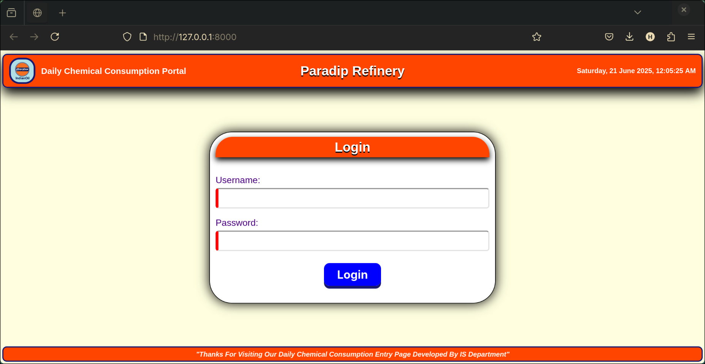
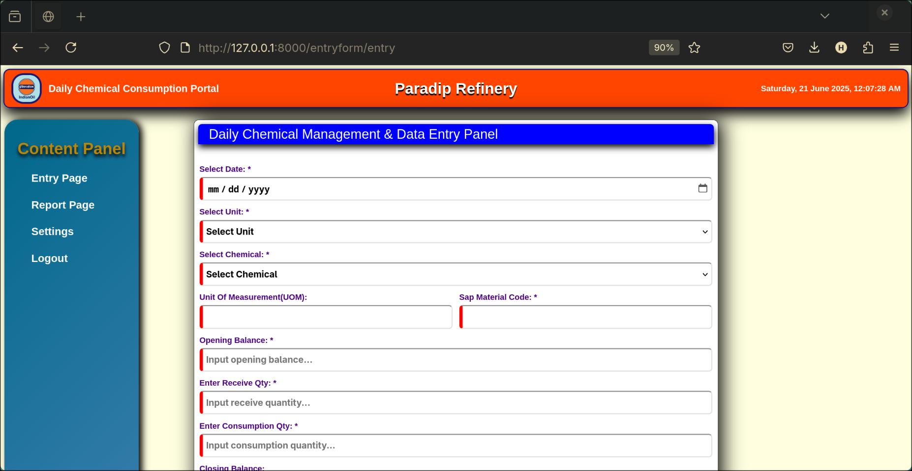
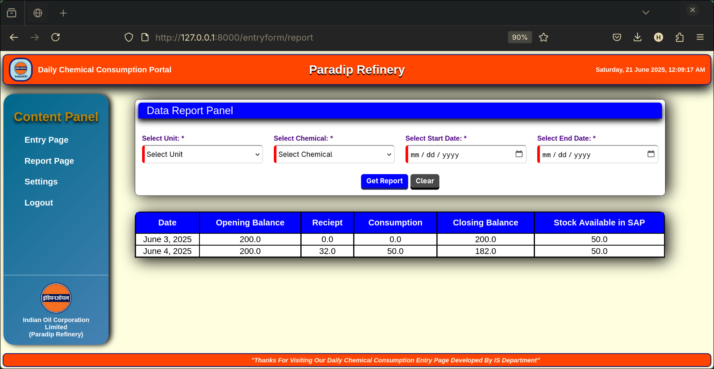

# Chemical Management Dashboard

## Introduction

This project is a web based Chemical Management Dashboard developed as part of my internship. The application is designed to streamline the handling of chemical data, providing an interface for users to manage inventories, track usage, and ensure compliance with safety regulations. The design focuses on a modular architecture to enable scalability and a strong focus on security to protect sensitive data.

---

## Technologies Used

- **Frontend**:

  - **HTML5** and **CSS3** for structuring and styling the user interface.
  - **JavaScript** for interactive elements and dynamic content.

- **Backend**:

  - **Django** as the primary backend framework, providing a secure and scalable foundation.
  - **Django ORM** for seamless database management and queries.

- **Database**:

  - **SQLite3** for storing and managing chemical inventory and user data.

- **Security**:

  - Django's built-in authentication and CSRF protection mechanisms.

---

